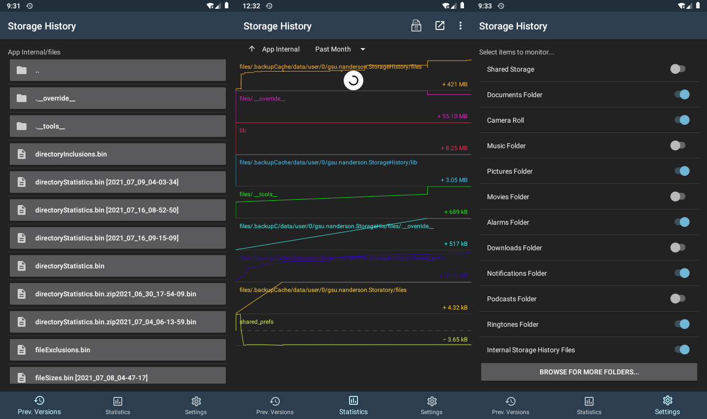

# Storage History
Storage backup & analysis over time  
with file versioning and usage trends for Android devices.

## Purpose
Even with Google One, Android device backups can be error-prone and mischievous...  
backup data erased without notice... the ability to have only a single backup which can get corrupted...

With this app users can monitor folders of their choice (and/or all of their external storage)  
and multiple changes to a file can result in multiple versions of that file being saved over time.

Usage trend statistics allow the user to see potentially problematic folders which have grown too quickly,  
as the capability of looking at current usage levels in other apps is often not enough,  
especially if you're constantly trying to save space.

This project aims to support multiple cloud providers in the near future,  
but for now backups can only be uploaded manually or through Android's Auto Backup feature (up to 25 MB).

## Development
Storage History's source code is split up into namespaces for [Collection](Collection) and [Analysis](Analysis),  
as well as a [Shared](Shared) namespace for UI and Logic that belongs to both or none of these behaviors.

Resources like the app's declarative [main layout file](Resources/layout/main.xml) are in the [Resources](Resources) folder,  
while their imperative counterparts such as the [main entry point](MainActivity.cs) remain at the top level.

[Xamarin.Android](https://docs.microsoft.com/en-us/xamarin/android/) allows the app to be written in C# and run in the CLR/Mono runtime,  
maintaining the performance of apps written in Java for Android's JVM *cough* *cough* [Runtime](https://en.wikipedia.org/wiki/Android_Runtime).

Multi-threading ensures the UI stays fluid while performing intensive operations.  
Multiple versions of a file are stored in a single zip archive to save space.  
Several Unix APIs like `mmap` and `ftruncate` are used in places like our [Unicode file reader](Shared/Logic/UnicodeFileStream.cs),  
to explore direct use of Android's linux kernel.

## Support
Only Android Pie or above is currently supported,  
but support could be expanded to Oreo or even Lollipop once unit tests are set up.
